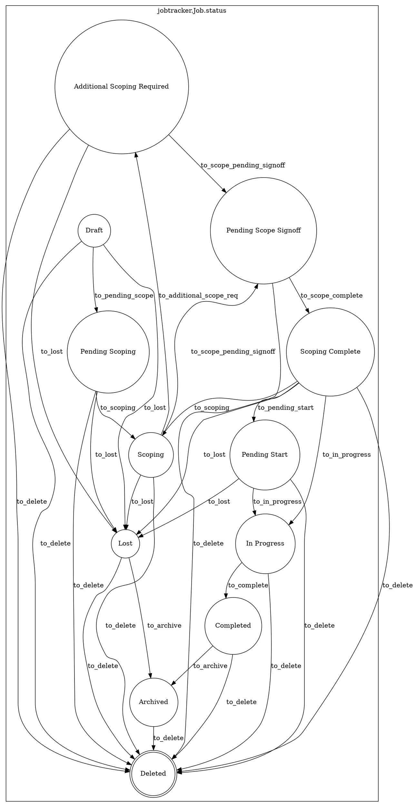

# Lifecycle

!!! Warning
    This page will be populated with more documentation soon.

A job has a `status` which follows a strict workflow. Much of the functionality within CHAOTICA for a job is tied to it's status.

The raw state diagram is below and shows the allowed transitions between states.

