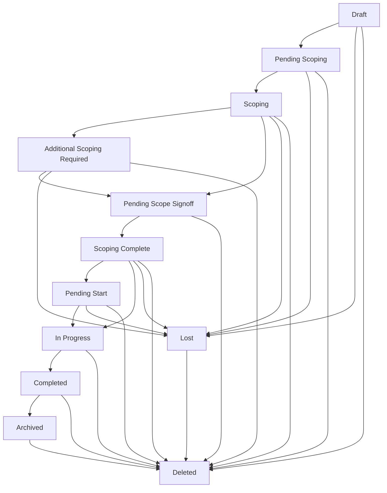

# Managing Jobs

Jobs are the core entity in CHAOTICA representing discrete pieces of work for clients. This guide covers creating, managing, and working with jobs throughout their lifecycle.

## What is a Job?

A job represents a discrete piece of work for a client, typically tied to a specific engagement or assessment. For example:
- Client wants their e-commerce system tested
- 6 months later, they want their internal office network tested

These would be two separate jobs as they are discrete pieces of work.

## Job Structure

Each job contains:
- **Basic Information**: Title, client, description
- **Classification**: Security classification level
- **Phases**: Individual service deliverables within the job
- **Timeline**: Start/end dates and milestones
- **Team Assignment**: Project leads, account managers, participants
- **Financial Information**: Budget, rates, framework agreements

## Creating a New Job

### Prerequisites
- You must have "Add Job" permissions in your organizational unit
- A client must exist in the system
- Services must be defined for the phases you want to create

### Step-by-Step Process

1. **Navigate to Jobs**
   - Go to the main dashboard
   - Click "Jobs" in the navigation menu
   - Click "Add New Job"

2. **Basic Information**
   ```
   Job Title: Clear, descriptive title
   Client: Select from existing clients
   Organizational Unit: Your team/unit
   Classification: Select appropriate security level
   ```

3. **Job Details**
   - **Description**: Detailed description of the work
   - **Background**: Context and background information
   - **Scope**: High-level scope of work
   - **Objectives**: What the job aims to achieve

4. **Financial Information**
   - **Framework Agreement**: Link to existing agreement (if applicable)
   - **Budget**: Total budget for the job
   - **Currency**: Currency for financial calculations

5. **Assignment**
   - **Account Manager**: Primary client contact
   - **Deputy Account Manager**: Backup contact (optional)
   - **Project Lead**: Technical lead for the job

## Job Status Workflow

Jobs follow a strict status workflow with defined transitions:



### Status Descriptions

- **Draft**: Initial creation, job details being defined
- **Pending Scoping**: Ready for scoping to begin
- **Scoping**: Active scoping work in progress
- **Additional Scoping Required**: More scoping work needed
- **Pending Scope Signoff**: Scoping complete, awaiting approval
- **Scoping Complete**: Scoping approved, ready for scheduling
- **Pending Start**: Scheduled but not yet started
- **In Progress**: Active work being performed
- **Completed**: All work finished
- **Lost**: Job not won or cancelled
- **Archived**: Completed job moved to archive
- **Deleted**: Job marked for deletion

### Status Transitions

Only certain status transitions are allowed:

| From | To | Required Permission |
|------|----|--------------------|
| Draft | Pending Scoping | Job editor |
| Pending Scoping | Scoping | Scoper role |
| Scoping | Pending Scope Signoff | Scoper role |
| Pending Scope Signoff | Scoping Complete | Manager role |
| Scoping Complete | In Progress | Manager role |
| In Progress | Completed | Manager role |

## Working with Existing Jobs

### Finding Jobs

**Search and Filters**:
- Use the search bar to find jobs by title or ID
- Filter by status, client, or organizational unit
- Sort by creation date, status, or deadline

**My Jobs View**:
- Jobs you're scheduled on
- Jobs you're leading or authoring
- Jobs you've scoped
- Jobs you're account manager for

### Editing Jobs

1. **Access Control**: You can edit a job if you have:
   - Edit permissions in the organizational unit
   - Are assigned as account manager
   - Are assigned as project lead
   - Have object-level permissions

2. **Editable Fields**: Depending on job status, different fields can be modified:
   - **Draft/Scoping**: All fields editable
   - **In Progress**: Limited to non-structural changes
   - **Completed**: Read-only except for notes

### Job Information Sections

**Overview Tab**:
- Basic job information
- Status and timeline
- Client and team assignments

**Phases Tab**:
- Individual service phases
- Phase scheduling and assignments
- Phase status tracking

**Timeline Tab**:
- Key milestones and dates
- Phase schedules
- Deadline tracking

**Financial Tab**:
- Budget information
- Framework agreement details
- Cost tracking

**Files Tab**:
- Job-related documents
- Reports and deliverables
- Client communications

**Notes Tab**:
- Internal notes and comments
- Status change history
- Team communications

## Job Scheduling

### Phase Scheduling
Each job consists of one or more phases that need to be scheduled:

1. **Create Phases**: Define the services to be delivered
2. **Resource Planning**: Identify required skills and team members
3. **Time Allocation**: Assign time slots to team members
4. **Deadline Management**: Set and track key dates

### Scheduling Considerations
- **Team Availability**: Check team member schedules
- **Skill Requirements**: Ensure appropriate expertise is assigned
- **Dependencies**: Consider phase dependencies and sequencing
- **Buffer Time**: Allow time for reviews and revisions

## Framework Agreements

Framework agreements allow linking multiple jobs under a single contract:

### Benefits
- **Centralized Tracking**: Monitor progress across all jobs in the framework
- **Budget Management**: Track total spend against framework budget
- **Reporting**: Generate consolidated reports across the framework

### Usage
1. Create a framework agreement in the client section
2. When creating jobs, link them to the appropriate framework
3. Monitor framework utilization in the reporting section

## Best Practices

### Job Creation
- Use clear, descriptive titles that include client name and service type
- Complete all required fields before changing status
- Add detailed descriptions to help team members understand context
- Set realistic timelines with appropriate buffer

### Status Management
- Only advance status when work is genuinely complete
- Use notes to document reasons for status changes
- Involve appropriate stakeholders in status transitions
- Keep clients informed of status changes

### Team Communication
- Use the notes section for internal team communications
- @ mention team members in notes for notifications
- Document important decisions and changes
- Keep a clear audit trail of job progression

### Quality Assurance
- Follow the defined TQA (Technical Quality Assurance) process
- Ensure PQA (Peer Quality Assurance) reviews are completed
- Document any deviations from standard procedures
- Maintain quality standards throughout the job lifecycle

## Troubleshooting

### Common Issues

**Cannot Change Job Status**:
- Check you have the required permissions
- Ensure all prerequisite conditions are met
- Verify the status transition is allowed

**Missing Jobs in My View**:
- Check you're assigned to the job in some capacity
- Verify the job status is in active statuses
- Ensure your organizational unit permissions are correct

**Unable to Edit Job**:
- Confirm you have edit permissions
- Check if the job status allows editing
- Verify you're not trying to edit read-only fields

**Scheduling Conflicts**:
- Use the scheduling view to check team availability
- Consider adjusting timelines or reassigning resources
- Check for leave requests or other commitments

### Getting Help

If you encounter issues:
1. Check this documentation for guidance
2. Contact your organizational unit manager
3. Reach out to system administrators
4. Use the built-in help system (if available)

## Related Topics

- [Phase Management](phases/lifecycle.md) - Managing individual phases within jobs
- [Client Management](../clients/adding_clients.md) - Setting up and managing clients
- [Scheduling](../scheduling/filtering.md) - Resource scheduling and planning
- [Reporting](../reporting/overview.md) - Job reporting and analytics