# Lifecycle

!!! Warning
    This page will be populated with more documentation soon.

Like a job, a Phase also has a `status` which follows a strict workflow. Even more of the functionality within CHAOTICA for a phase is tied to it's status and will also affect a Job's status.

The raw state diagram is below and shows the allowed transitions between states. (Yes, I know it's mental to read)

```dot
digraph {
        subgraph cluster_jobtracker_Phase_status {
                graph [label="jobtracker.Phase.status"]
                "jobtracker.Phase.status.18" [label=Deleted shape=circle]
                "jobtracker.Phase.status.3" [label="Schedule Confirmed" shape=circle]
                "jobtracker.Phase.status.11" [label="Pending Presentation QA" shape=circle]
                "jobtracker.Phase.status.14" [label=Completed shape=circle]
                "jobtracker.Phase.status.12" [label="Pres QA" shape=circle]
                "jobtracker.Phase.status.6" [label="Ready to Begin" shape=circle]
                "jobtracker.Phase.status.0" [label=Draft shape=circle]
                "jobtracker.Phase.status.2" [label="Schedule Tentative" shape=circle]
                "jobtracker.Phase.status.19" [label=Archived shape=circle]
                "jobtracker.Phase.status.10" [label="Author Tech Updates" shape=circle]
                "jobtracker.Phase.status.16" [label=Cancelled shape=circle]
                "jobtracker.Phase.status.15" [label=Delivered shape=circle]
                "jobtracker.Phase.status.5" [label="Client Not Ready" shape=circle]
                "jobtracker.Phase.status.9" [label="Tech QA" shape=circle]
                "jobtracker.Phase.status.17" [label=Postponed shape=circle]
                "jobtracker.Phase.status.8" [label="Pending Technical QA" shape=circle]
                "jobtracker.Phase.status.4" [label="Pre-checks" shape=circle]
                "jobtracker.Phase.status.1" [label="Pending Scheduling" shape=circle]
                "jobtracker.Phase.status.13" [label="Author Pres Updates" shape=circle]
                "jobtracker.Phase.status.7" [label="In Progress" shape=circle]
                "jobtracker.Phase.status.5" -> "jobtracker.Phase.status.17" [label=to_postponed]
                "jobtracker.Phase.status.13" -> "jobtracker.Phase.status.11" [label=to_pending_pres_qa]
                "jobtracker.Phase.status.10" -> "jobtracker.Phase.status.8" [label=to_pending_tech_qa]
                "jobtracker.Phase.status.0" -> "jobtracker.Phase.status.17" [label=to_postponed]
                "jobtracker.Phase.status.3" -> "jobtracker.Phase.status.17" [label=to_postponed]
                "jobtracker.Phase.status.5" -> "jobtracker.Phase.status.6" [label=to_ready]
                "jobtracker.Phase.status.13" -> "jobtracker.Phase.status.17" [label=to_postponed]
                "jobtracker.Phase.status.14" -> "jobtracker.Phase.status.17" [label=to_postponed]
                "jobtracker.Phase.status.9" -> "jobtracker.Phase.status.11" [label=to_pending_pres_qa]
                "jobtracker.Phase.status.17" -> "jobtracker.Phase.status.16" [label=to_cancelled]
                "jobtracker.Phase.status.15" -> "jobtracker.Phase.status.17" [label=to_postponed]
                "jobtracker.Phase.status.7" -> "jobtracker.Phase.status.8" [label=to_pending_tech_qa]
                "jobtracker.Phase.status.7" -> "jobtracker.Phase.status.16" [label=to_cancelled]
                "jobtracker.Phase.status.2" -> "jobtracker.Phase.status.1" [label=to_pending_sched]
                "jobtracker.Phase.status.3" -> "jobtracker.Phase.status.16" [label=to_cancelled]
                "jobtracker.Phase.status.11" -> "jobtracker.Phase.status.12" [label=to_pres_qa]
                "jobtracker.Phase.status.8" -> "jobtracker.Phase.status.9" [label=to_tech_qa]
                "jobtracker.Phase.status.2" -> "jobtracker.Phase.status.18" [label=to_deleted]
                "jobtracker.Phase.status.0" -> "jobtracker.Phase.status.1" [label=to_pending_sched]
                "jobtracker.Phase.status.15" -> "jobtracker.Phase.status.16" [label=to_cancelled]
                "jobtracker.Phase.status.11" -> "jobtracker.Phase.status.18" [label=to_deleted]
                "jobtracker.Phase.status.18" -> "jobtracker.Phase.status.16" [label=to_cancelled]
                "jobtracker.Phase.status.4" -> "jobtracker.Phase.status.18" [label=to_deleted]
                "jobtracker.Phase.status.10" -> "jobtracker.Phase.status.18" [label=to_deleted]
                "jobtracker.Phase.status.12" -> "jobtracker.Phase.status.16" [label=to_cancelled]
                "jobtracker.Phase.status.2" -> "jobtracker.Phase.status.16" [label=to_cancelled]
                "jobtracker.Phase.status.16" -> "jobtracker.Phase.status.17" [label=to_postponed]
                "jobtracker.Phase.status.18" -> "jobtracker.Phase.status.17" [label=to_postponed]
                "jobtracker.Phase.status.12" -> "jobtracker.Phase.status.17" [label=to_postponed]
                "jobtracker.Phase.status.1" -> "jobtracker.Phase.status.3" [label=to_sched_confirmed]
                "jobtracker.Phase.status.1" -> "jobtracker.Phase.status.18" [label=to_deleted]
                "jobtracker.Phase.status.3" -> "jobtracker.Phase.status.1" [label=to_pending_sched]
                "jobtracker.Phase.status.6" -> "jobtracker.Phase.status.7" [label=to_in_progress]
                "jobtracker.Phase.status.9" -> "jobtracker.Phase.status.18" [label=to_deleted]
                "jobtracker.Phase.status.7" -> "jobtracker.Phase.status.14" [label=to_completed]
                "jobtracker.Phase.status.0" -> "jobtracker.Phase.status.18" [label=to_deleted]
                "jobtracker.Phase.status.19" -> "jobtracker.Phase.status.16" [label=to_cancelled]
                "jobtracker.Phase.status.14" -> "jobtracker.Phase.status.18" [label=to_deleted]
                "jobtracker.Phase.status.3" -> "jobtracker.Phase.status.4" [label=to_pre_checks]
                "jobtracker.Phase.status.14" -> "jobtracker.Phase.status.15" [label=to_delivered]
                "jobtracker.Phase.status.4" -> "jobtracker.Phase.status.6" [label=to_ready]
                "jobtracker.Phase.status.9" -> "jobtracker.Phase.status.10" [label=to_tech_qa_updates]
                "jobtracker.Phase.status.19" -> "jobtracker.Phase.status.18" [label=to_deleted]
                "jobtracker.Phase.status.12" -> "jobtracker.Phase.status.13" [label=to_pres_qa_updates]
                "jobtracker.Phase.status.14" -> "jobtracker.Phase.status.16" [label=to_cancelled]
                "jobtracker.Phase.status.11" -> "jobtracker.Phase.status.16" [label=to_cancelled]
                "jobtracker.Phase.status.8" -> "jobtracker.Phase.status.18" [label=to_deleted]
                "jobtracker.Phase.status.6" -> "jobtracker.Phase.status.18" [label=to_deleted]
                "jobtracker.Phase.status.4" -> "jobtracker.Phase.status.16" [label=to_cancelled]
                "jobtracker.Phase.status.5" -> "jobtracker.Phase.status.18" [label=to_deleted]
                "jobtracker.Phase.status.12" -> "jobtracker.Phase.status.14" [label=to_completed]
                "jobtracker.Phase.status.7" -> "jobtracker.Phase.status.18" [label=to_deleted]
                "jobtracker.Phase.status.10" -> "jobtracker.Phase.status.16" [label=to_cancelled]
                "jobtracker.Phase.status.2" -> "jobtracker.Phase.status.17" [label=to_postponed]
                "jobtracker.Phase.status.13" -> "jobtracker.Phase.status.18" [label=to_deleted]
                "jobtracker.Phase.status.4" -> "jobtracker.Phase.status.5" [label=to_not_ready]
                "jobtracker.Phase.status.3" -> "jobtracker.Phase.status.18" [label=to_deleted]
                "jobtracker.Phase.status.11" -> "jobtracker.Phase.status.17" [label=to_postponed]
                "jobtracker.Phase.status.16" -> "jobtracker.Phase.status.19" [label=to_archived]
                "jobtracker.Phase.status.9" -> "jobtracker.Phase.status.17" [label=to_postponed]
                "jobtracker.Phase.status.15" -> "jobtracker.Phase.status.18" [label=to_deleted]
                "jobtracker.Phase.status.4" -> "jobtracker.Phase.status.17" [label=to_postponed]
                "jobtracker.Phase.status.15" -> "jobtracker.Phase.status.19" [label=to_archived]
                "jobtracker.Phase.status.18" -> "jobtracker.Phase.status.19" [label=to_archived]
                "jobtracker.Phase.status.1" -> "jobtracker.Phase.status.2" [label=to_sched_tentative]
                "jobtracker.Phase.status.10" -> "jobtracker.Phase.status.17" [label=to_postponed]
                "jobtracker.Phase.status.8" -> "jobtracker.Phase.status.16" [label=to_cancelled]
                "jobtracker.Phase.status.16" -> "jobtracker.Phase.status.18" [label=to_deleted]
                "jobtracker.Phase.status.6" -> "jobtracker.Phase.status.16" [label=to_cancelled]
                "jobtracker.Phase.status.3" -> "jobtracker.Phase.status.2" [label=to_sched_tentative]
                "jobtracker.Phase.status.1" -> "jobtracker.Phase.status.16" [label=to_cancelled]
                "jobtracker.Phase.status.5" -> "jobtracker.Phase.status.16" [label=to_cancelled]
                "jobtracker.Phase.status.17" -> "jobtracker.Phase.status.1" [label=to_pending_sched]
                "jobtracker.Phase.status.19" -> "jobtracker.Phase.status.17" [label=to_postponed]
                "jobtracker.Phase.status.13" -> "jobtracker.Phase.status.16" [label=to_cancelled]
                "jobtracker.Phase.status.12" -> "jobtracker.Phase.status.18" [label=to_deleted]
                "jobtracker.Phase.status.0" -> "jobtracker.Phase.status.16" [label=to_cancelled]
                "jobtracker.Phase.status.2" -> "jobtracker.Phase.status.3" [label=to_sched_confirmed]
                "jobtracker.Phase.status.17" -> "jobtracker.Phase.status.18" [label=to_deleted]
                "jobtracker.Phase.status.7" -> "jobtracker.Phase.status.17" [label=to_postponed]
                "jobtracker.Phase.status.9" -> "jobtracker.Phase.status.16" [label=to_cancelled]
                "jobtracker.Phase.status.8" -> "jobtracker.Phase.status.17" [label=to_postponed]
                "jobtracker.Phase.status.6" -> "jobtracker.Phase.status.17" [label=to_postponed]
                "jobtracker.Phase.status.1" -> "jobtracker.Phase.status.17" [label=to_postponed]
        }
}
```

