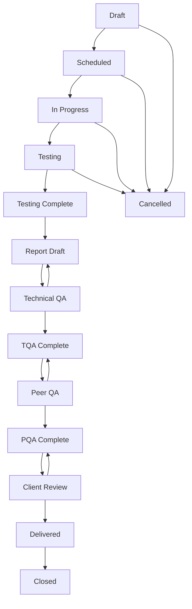

# Managing Phases

Phases represent individual service deliverables within a job. Each phase corresponds to a specific service type and has its own workflow, scheduling, and delivery requirements.

## Understanding Phases

### What is a Phase?

A phase is a child component of a job that represents a specific service or deliverable. For example, if a client wants both their website and network infrastructure tested, you would create:

1. **E-Commerce Portal Phase** - Web Application Assessment service
2. **E-Commerce Infrastructure Phase** - Infrastructure Assessment service

### Phase Components

Each phase contains:
- **Service Definition**: The type of assessment or work being performed
- **Scope**: Detailed scope of work for this specific phase
- **Schedule**: Time allocation and resource assignment
- **Team Assignment**: Project lead, report author, and team members
- **Quality Assurance**: TQA and PQA processes
- **Deliverables**: Reports and outputs from the phase

## Creating Phases

### Prerequisites

- Parent job must exist and be in appropriate status
- Service types must be defined in the system
- You must have phase creation permissions

### Step-by-Step Process

1. **Navigate to Job**
   - Go to the job where you want to add a phase
   - Click the "Phases" tab
   - Click "Add New Phase"

2. **Basic Phase Information**
   ```
   Phase Name: Descriptive name for this phase
   Service: Select the service type being delivered
   Description: Detailed description of the phase work
   Priority: Phase priority (High, Medium, Low)
   ```

3. **Scope Definition**
   ```
   Scope: Detailed scope of work
   Objectives: Specific objectives for this phase
   Assumptions: Key assumptions about the work
   Constraints: Any limitations or constraints
   Exclusions: What is specifically not included
   ```

4. **Timeline and Scheduling**
   ```
   Estimated Start Date: When the phase should begin
   Estimated End Date: When the phase should complete
   Duration: Number of working days required
   Dependencies: Other phases this depends on
   ```

5. **Team Assignment**
   ```
   Project Lead: Technical lead for this phase
   Report Author: Person responsible for the final report
   TQA Reviewer: Technical Quality Assurance reviewer
   PQA Reviewer: Peer Quality Assurance reviewer
   ```

6. **Service-Specific Settings**
   ```
   Testing Methodology: Approach to be used
   Environment: Target environment details  
   Access Requirements: Special access needed
   Tools and Techniques: Specific tools to be used
   ```

## Phase Status Workflow

Phases follow their own status workflow, separate from but related to the job status:



### Status Descriptions

- **Draft**: Phase being planned and configured
- **Scheduled**: Phase has been scheduled with team members
- **In Progress**: Active work has begun
- **Testing**: Technical testing/assessment work underway
- **Testing Complete**: All testing work finished
- **Report Draft**: Report writing in progress
- **Technical QA**: Technical quality assurance review
- **TQA Complete**: Technical QA approved
- **Peer QA**: Peer quality assurance review
- **PQA Complete**: Peer QA approved  
- **Client Review**: Client reviewing deliverables
- **Delivered**: Deliverables provided to client
- **Closed**: Phase completely finished
- **Cancelled**: Phase cancelled or terminated

### Status Transitions and Permissions

| From | To | Required Role |
|------|----|-----------   |
| Draft | Scheduled | Manager |
| Scheduled | In Progress | Project Lead |
| In Progress | Testing | Project Lead |
| Testing | Testing Complete | Project Lead |
| Testing Complete | Report Draft | Report Author |
| Report Draft | Technical QA | Report Author |
| Technical QA | TQA Complete | TQA Reviewer |
| TQA Complete | Peer QA | Manager |
| Peer QA | PQA Complete | PQA Reviewer |
| PQA Complete | Client Review | Manager |
| Client Review | Delivered | Manager |
| Delivered | Closed | Manager |

## Phase Scheduling

### Resource Allocation

**Time Slot Management**:
- Assign specific time periods to team members
- Define roles for each time slot (Testing, Reporting, Review)
- Set working hours and availability
- Handle schedule conflicts and changes

**Role-Based Scheduling**:
- **Testing Slots**: Hands-on assessment work
- **Reporting Slots**: Report writing and documentation
- **Review Slots**: Quality assurance and review activities
- **Management Slots**: Coordination and oversight

### Scheduling Process

1. **Estimate Effort**
   - Break down work into component tasks
   - Estimate time required for each task
   - Consider complexity and risk factors
   - Add buffer time for unexpected issues

2. **Resource Planning**
   - Identify required skills and expertise
   - Check team member availability
   - Consider training and development needs
   - Plan for knowledge transfer

3. **Create Schedule**
   - Assign team members to time slots
   - Set start and end dates for each slot
   - Define deliverables and milestones
   - Coordinate with other phases and dependencies

4. **Monitor and Adjust**
   - Track progress against schedule
   - Identify delays and issues early
   - Adjust resources as needed
   - Communicate changes to stakeholders

### Scheduling Best Practices

**Realistic Planning**:
- Use historical data for effort estimates
- Include time for learning curve and ramp-up
- Plan for interruptions and context switching
- Consider team member experience levels

**Dependencies Management**:
- Identify phase dependencies early
- Plan for resource sharing between phases
- Coordinate schedules to avoid conflicts
- Build in flexibility for schedule changes

**Buffer Management**:
- Add 15-20% buffer to estimates
- Reserve time for unexpected discoveries
- Plan for rework and revision cycles
- Account for client availability and feedback

## Phase Execution

### Testing Activities

**Preparation**:
- Review scope and objectives
- Set up testing environment
- Gather necessary tools and credentials
- Coordinate access with client contacts

**Execution**:
- Follow defined methodology and approach
- Document findings and evidence
- Maintain testing logs and notes
- Regular progress updates and communication

**Documentation**:
- Record all activities and findings
- Capture evidence and screenshots
- Document remediation recommendations
- Prepare summary for reporting phase

### Reporting Process

**Report Structure**:
- Executive summary for business audience
- Technical findings with detailed evidence
- Risk ratings and impact assessments
- Remediation recommendations and priorities
- Appendices with supporting information

**Writing Guidelines**:
- Clear, concise, and professional language
- Appropriate technical depth for audience
- Consistent formatting and structure
- Accurate and verifiable information

**Review Cycles**:
- Internal review by report author
- Technical review by subject matter experts
- Quality assurance by designated reviewers
- Client review and feedback incorporation

## Quality Assurance Process

### Technical Quality Assurance (TQA)

**TQA Objectives**:
- Verify technical accuracy of findings
- Ensure completeness of testing coverage
- Validate evidence and supporting materials
- Confirm appropriate risk ratings

**TQA Process**:
1. TQA reviewer assigned during phase creation
2. Report submitted for TQA when draft complete
3. Reviewer examines findings, evidence, and recommendations
4. Feedback provided to report author
5. Revisions made based on TQA feedback
6. TQA approval granted when satisfied

**TQA Checklist**:
- [ ] All findings properly documented
- [ ] Evidence sufficient to support conclusions
- [ ] Risk ratings appropriate and justified
- [ ] Recommendations practical and actionable
- [ ] Technical accuracy verified
- [ ] No false positives or incorrect interpretations

### Peer Quality Assurance (PQA)

**PQA Objectives**:
- Independent review of report quality
- Consistency with organizational standards
- Client readiness and professional presentation
- Overall deliverable quality assurance

**PQA Process**:
1. PQA reviewer assigned (different from TQA reviewer)
2. Report submitted for PQA after TQA completion
3. Comprehensive review of entire deliverable
4. Focus on presentation, clarity, and professionalism
5. Final approval before client delivery

**PQA Focus Areas**:
- [ ] Report structure and organization
- [ ] Language clarity and professionalism
- [ ] Consistency with templates and standards
- [ ] Executive summary quality
- [ ] Visual aids and formatting
- [ ] Client-specific considerations

## Phase Deliverables

### Report Templates

**Standard Templates**:
- Web application assessment reports
- Infrastructure assessment reports
- Penetration testing reports
- Compliance assessment reports
- Specialized service reports

**Template Components**:
- Cover page and document control
- Executive summary
- Methodology and approach
- Detailed findings
- Risk assessment matrix
- Recommendations
- Appendices and references

### Supporting Materials

**Evidence Packages**:
- Screenshots and proof-of-concept code
- Network diagrams and system documentation
- Log files and testing artifacts
- Tool outputs and scan results

**Presentation Materials**:
- Executive briefing slides
- Technical deep-dive presentations
- Remediation planning workshops
- Follow-up meeting materials

## Phase Dependencies

### Inter-Phase Dependencies

**Sequential Dependencies**:
- Infrastructure assessment before application testing
- Network mapping before vulnerability assessment
- Reconnaissance before exploitation phases

**Parallel Dependencies**:
- Shared resources between concurrent phases
- Coordinated access to client systems
- Integrated reporting and recommendations

**Resource Dependencies**:
- Specialized skills and expertise
- Testing tools and software licenses
- Client access and coordination
- Laboratory and testing environments

### Managing Dependencies

**Dependency Tracking**:
- Document all dependencies during planning
- Monitor dependency status throughout execution
- Communicate changes and impacts
- Adjust schedules based on dependency changes

**Risk Mitigation**:
- Identify critical path dependencies
- Plan alternative approaches
- Build flexibility into schedules
- Maintain contingency plans

## Phase Metrics and Reporting

### Performance Metrics

**Schedule Performance**:
- Planned vs. actual start/end dates
- Resource utilization rates
- Schedule variance and trends
- Milestone achievement rates

**Quality Metrics**:
- TQA/PQA approval rates
- Revision cycles and rework
- Client satisfaction scores
- Finding accuracy and validity

**Efficiency Metrics**:
- Time per finding discovered
- Report writing productivity
- Review cycle duration
- Overall phase completion time

### Phase Reporting

**Status Reports**:
- Weekly phase status updates
- Resource utilization summaries
- Issue and risk registers
- Milestone and deliverable tracking

**Completion Reports**:
- Phase outcome summary
- Lessons learned and improvements
- Resource utilization analysis
- Recommendations for future phases

## Troubleshooting

### Common Issues

**Schedule Delays**:
- Identify root causes early
- Adjust resource allocation
- Negotiate scope or timeline changes
- Communicate impacts to stakeholders

**Quality Issues**:
- Additional training for team members
- Enhanced review processes
- Better templates and standards
- Improved quality checkpoints

**Resource Conflicts**:
- Prioritize phases based on business value
- Negotiate resource sharing agreements
- Adjust schedules to minimize conflicts
- Consider external resources or contractors

**Client Access Issues**:
- Proactive coordination with client contacts
- Clear communication of requirements
- Escalation procedures for delays
- Alternative testing approaches

## Best Practices

### Phase Planning

**Comprehensive Scoping**:
- Involve technical experts in scope definition
- Consider all aspects of the target environment
- Plan for both expected and unexpected findings
- Include time for client coordination

**Realistic Scheduling**:
- Base estimates on historical data
- Include appropriate buffer time
- Consider team member availability
- Plan for dependencies and coordination

### Phase Execution

**Regular Communication**:
- Daily standups for phase teams
- Weekly status updates to stakeholders
- Proactive issue escalation
- Clear documentation of decisions

**Quality Focus**:
- Follow established methodologies
- Document everything thoroughly
- Seek peer input and feedback
- Continuous improvement mindset

### Phase Closeout

**Knowledge Capture**:
- Document lessons learned
- Update methodologies and templates
- Share insights with other teams
- Build organizational knowledge base

**Client Relationship**:
- Ensure client satisfaction
- Gather feedback for improvement
- Identify follow-on opportunities
- Maintain professional relationships

## Related Topics

- [Job Lifecycle](../lifecycle.md) - Overall job management and workflow
- [Team Management](../../team/overview.md) - Managing phase teams and resources
- [Quality Assurance](../../processes/quality_assurance.md) - Detailed QA processes
- [Reporting](../../reporting/overview.md) - Report generation and delivery
- [Scheduling](../../scheduling/overview.md) - Resource scheduling and planning