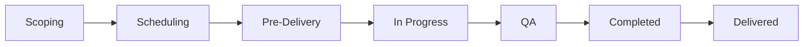

# Organisational Units

Organisational units are the teams and departments that own jobs and manage members in CHAOTICA. They form the core organisational structure — permissions, job ownership, and scheduling access are all scoped to units.

## Detail Page

The unit detail page is accessed from the unit list or by navigating to a specific unit. The header displays:

- Unit name and description
- Special requirements (if any)
- Unit lead profile
- Action buttons: **Add Member** (requires `manage_members`), **Edit** (requires `change_organisationalunit`), **Join** (if not already a member)

## Tabs

The detail page is organised into tabs. Some tabs are always visible; others require specific permissions.

### Team

*Always visible.*

Displays a table of active unit members with their assigned roles. Members with the `manage_members` permission see a dropdown menu on each row to manage roles or review pending join requests.

### Jobs

*Requires `can_view_jobs` permission.*

An AJAX-loaded table listing all jobs owned by the unit, with phase counts and status information.

### Board

*Requires `can_view_jobs` permission.*

A kanban-style board showing all active phases for the unit's jobs, organised by workflow stage. See [Kanban Board](#kanban-board) below.

### Stats

*Always visible.*

AJAX-loaded utilisation statistics with date range filtering. Shows upcoming availability metrics across four time periods (this week, 2 weeks, 4 weeks, 8 weeks) with utilisation percentages for confirmed, tentative, non-delivery, and available time. Includes an ECharts bar chart visualisation.

### Reviews

*Requires `can_view_all_reviews` permission.*

Shows in-progress and recently completed (last 30 days) QA reviews for the unit. Users with `can_conduct_review` permission can start new reviews from this tab.

## Kanban Board

The board tab provides a read-only kanban view of all active phases across the unit's jobs. Phases are mapped to seven columns based on their status:

| Column | Phase Statuses |
|---|---|
| Scoping | Pending scoping, Scoping in progress, Pending scope sign-off |
| Scheduling | Pending scheduling |
| Pre-Delivery | Scheduled and confirmed, Ready for pre-checks, Pre-checks overdue, Client not ready |
| In Progress | In progress |
| QA | Pending TQA, Pending PQA |
| Completed | Completed, Pending delivery |
| Delivered | Delivered |

Phases with statuses **Cancelled**, **Postponed**, **Deleted**, or **Archived** are excluded from the board.

Each card displays:

- Status badge with colour coding
- Service type
- Phase ID and title
- Client and job name
- Project lead avatar and name
- Date range

Cards link directly to the phase detail page. The board is **read-only** — phases cannot be moved by drag-and-drop.

## Permissions

Organisational unit permissions are managed via Django Guardian at the object level. Each permission controls access to specific features on the unit detail page and related operations.

| Permission | Controls |
|---|---|
| `view_organisationalunit` | Access to the unit detail page |
| `change_organisationalunit` | "Edit" button on the detail page |
| `manage_members` | "Add Member" button, manage roles, review join requests |
| `can_view_jobs` | Jobs tab, Board tab |
| `can_schedule_job` | Creating and modifying time slots in the scheduler |
| `can_view_all_reviews` | Reviews tab |
| `can_conduct_review` | "Start New Review" button in Reviews tab |
| `view_users_schedule` | Viewing member schedules |
| `can_add_job` | Creating new jobs for the unit |
| `can_scope_jobs` | Scoping jobs |
| `can_signoff_scopes` | Signing off job scopes |
| `can_tqa_jobs` | Performing technical QA |
| `can_pqa_jobs` | Performing presentation QA |
| `can_view_all_leave_requests` | Viewing all member leave requests |
| `can_approve_leave_requests` | Approving leave requests |

## Joining a Unit

Users can request to join a unit using the **Join** button. Depending on the unit's configuration, the join may be:

- **Immediate** — the user is added directly
- **Approval required** — a join request is created and must be reviewed by a member with `manage_members` permission

## Related Topics

- [Managing Jobs](../Jobs/managing_jobs.md) — Jobs owned by organisational units
- [User Management](../team/user_management.md) — User profiles and role assignments
- [Scheduling Overview](../scheduling/overview.md) — Scheduling within unit context
