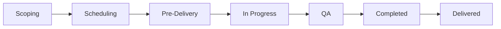

# Organisational Units

Organisational units are the teams and departments that own jobs and manage members in CHAOTICA. They form the core organisational structure — permissions, job ownership, and scheduling access are all scoped to units.

## Detail Page

The unit detail page is accessed from the unit list or by navigating to a specific unit. The header displays:

- Unit name and description
- **Leads** — the unit's lead(s) shown as clickable avatar chips linking to each profile (or "No leads assigned"). Being named a lead automatically grants that person **manager rights** on the unit (including the ability to add and [import members](preloading_members.md)).
- **At-a-glance stats**:
    - **Phases in flight** — count of the unit's phases currently in progress or in QA
    - **Team utilisation** — confirmed utilisation across the coming four weeks. Utilisation is calculated over **consultants only** (the members who get booked onto delivery), so managers, sales and other roles don't drag the figure down. This figure is loaded asynchronously (a spinner resolves to a percentage) because it is calculated from the full schedule.
- Special requirements (if any) shown as a highlighted banner
- Actions: a **Members** dropdown grouping **Add Member**, **Pre-load Member** and **Import CSV** (all require `manage_members`), and an **Edit** button (requires `change_organisationalunit`)

> **Add Member** adds an *existing* user; **Pre-load Member** and **Import CSV** let you onboard people who haven't logged in yet. See [Pre-loading & Importing Members](preloading_members.md).
>
> Membership is manager-managed: there is no self-service join. A unit lead or anyone with `manage_members` adds people to the unit; the person doesn't request access themselves.

## Tabs

The detail page is organised into tabs. Some tabs are always visible; others require specific permissions.

### Team

*Always visible.*

Displays a table of active unit members with, per member:

- **Member** — name and avatar (links to the profile)
- **Job level & title** — current job-level badge and job title
- **Utilisation** — a bar and percentage of confirmed utilisation across the coming four weeks (consultants only; other roles show "—")
- **Active jobs** — the number of the unit's active jobs the member is scheduled on
- **Roles** — assigned unit role badges
- **Actions** — a per-row menu. Everyone sees **View Profile**, **View Schedule** and **Email**. Members with `manage_members` additionally get:
    - **Manage Roles** — edit the member's unit roles
    - **Make Unit Lead** / **Remove as Lead** — promote the member to a unit lead (granting manager rights) or demote them again; the label reflects their current status. Demoting a lead also removes the manager role their lead status granted.
    - **Remove from Unit** — offboard the member (not shown for yourself). This is a soft-leave: the person loses access to the unit and its jobs and is dropped from the roster, but their membership history is kept, so re-adding them restores access. Removing a member also clears any lead status.

Utilisation and active-job counts are computed in bulk for the whole team, so the table stays fast regardless of member count.

The table can be filtered above the header by **Role** and **Job level**, and searched
by the free-text box (name, title, etc.). Members whose account is **disabled** are
hidden by default; tick **Show disabled users** to include them (they're tagged with a
"Disabled" badge).

### Jobs

*Requires `can_view_jobs` permission.*

An AJAX-loaded table listing all jobs owned by the unit, with phase counts and status information.

### Board

*Requires `can_view_jobs` permission.*

A kanban-style board showing all active phases for the unit's jobs, organised by workflow stage. See [Kanban Board](#kanban-board) below.

### Stats

*Always visible.*

AJAX-loaded statistics with date-range filtering, laid out top to bottom:

1. **Summary tiles** — active members, active jobs, phases delivered in the selected range, coming-4-week utilisation, and (only for users with `can_view_jobs`) total active-job revenue.
2. **Upcoming availability** — consultant utilisation across four time periods (this week, 2 weeks, 4 weeks, 8 weeks) for confirmed, tentative, non-delivery, and available time, with a stacked ECharts bar chart.
3. **Delivery throughput** — phases delivered per month over the last six months (bar chart).
4. **Service breakdown** — phases grouped by service (bar chart).
5. **Job pipeline** — job counts by status.
6. **Consultant utilisation table** — each consultant's confirmed utilisation over the selected date range (utilisation is tracked for consultants only).

The offcanvas **Raw Data** panel shows the underlying JSON used to build the page.

### Reviews

*Requires `can_view_all_reviews` permission.*

Shows in-progress and recently completed (last 30 days) QA reviews for the unit. Users with `can_conduct_review` permission can start new reviews from this tab.

## Kanban Board

The board tab provides a read-only kanban view of all active phases across the unit's jobs. Phases are mapped to seven columns based on their status:

```mermaid
flowchart LR
    A[Scoping] --> B[Scheduling]
    B --> C[Pre-Delivery]
    C --> D[In Progress]
    D --> E[QA]
    E --> F[Completed]
    F --> G[Delivered]
```

| Column | Phase Statuses |
|---|---|
| Scoping | Pending scoping, Scoping in progress, Pending scope sign-off |
| Scheduling | Pending scheduling |
| Pre-Delivery | Scheduled and confirmed, Ready for pre-checks, Pre-checks overdue, Client not ready |
| In Progress | In progress |
| QA | Pending TQA, Pending PQA |
| Completed | Completed, Pending delivery |
| Delivered | Delivered |

Phases with statuses **Cancelled**, **Postponed**, **Deleted**, or **Archived** are excluded from the board.

The two terminal columns — **Completed** and **Delivered** — are bounded to the **last 30 days** so they don't grow unbounded; each carries a "Last 30 days" badge in its header. Older completed/delivered phases are not loaded.

Each card displays:

- Status badge with colour coding
- Service type
- Phase ID and title
- Client and job name
- Project lead avatar and name
- Date range

Cards link directly to the phase detail page. The board is **read-only** — phases cannot be moved by drag-and-drop.

## Permissions

Organisational unit permissions are managed via Django Guardian at the object level. Each permission controls access to specific features on the unit detail page and related operations.

| Permission | Controls |
|---|---|
| `view_organisationalunit` | Access to the unit detail page |
| `change_organisationalunit` | "Edit" button on the detail page |
| `manage_members` | "Add Member" button, manage roles, make/remove leads, remove members |
| `can_view_jobs` | Jobs tab, Board tab |
| `can_schedule_job` | Creating and modifying time slots in the scheduler |
| `can_view_all_reviews` | Reviews tab |
| `can_conduct_review` | "Start New Review" button in Reviews tab |
| `view_users_schedule` | Viewing member schedules |
| `can_add_job` | Creating new jobs for the unit |
| `can_scope_jobs` | Scoping jobs |
| `can_signoff_scopes` | Signing off job scopes |
| `can_tqa_jobs` | Performing technical QA |
| `can_pqa_jobs` | Performing presentation QA |
| `can_view_all_leave_requests` | Viewing all member leave requests |
| `can_approve_leave_requests` | Approving leave requests |

## Membership

Unit membership is manager-managed — there is no self-service join. A unit lead, or anyone holding `manage_members`, adds people via **Add Member** (existing users) or **Pre-load Member** / **Import CSV** (people who haven't logged in yet), and removes them via **Remove from Unit** in the team row menu. See [Pre-loading & Importing Members](preloading_members.md).

## Related Topics

- [Managing Jobs](../Jobs/managing_jobs.md) — Jobs owned by organisational units
- [User Management](../team/user_management.md) — User profiles and role assignments
- [Scheduling Overview](../scheduling/overview.md) — Scheduling within unit context
