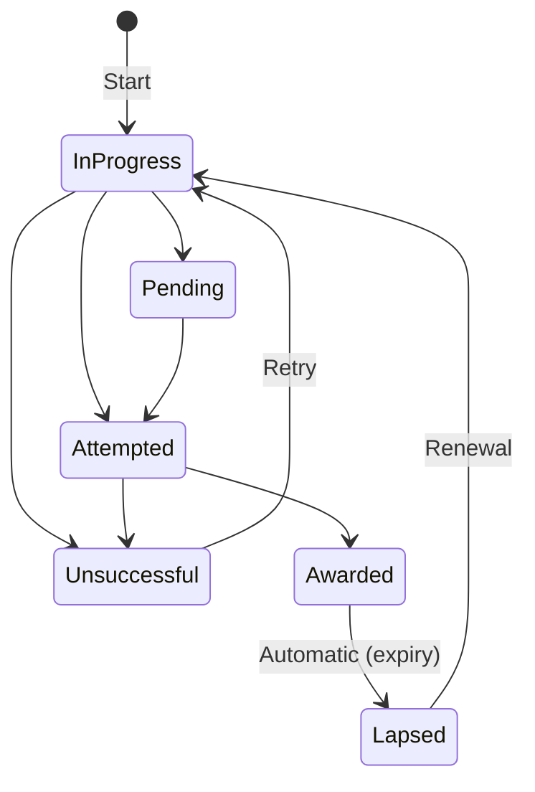

# Qualifications

CHAOTICA provides a qualifications tracking system to manage professional certifications, accreditations, and credentials held by team members. This helps organisations maintain compliance, monitor team capabilities, and ensure qualifications remain current.

!!! tip "Common Use Cases"
    Tracking CREST certifications, OSCP/OSCE credentials, CEH certifications, CHECK team member status, or any other professional qualification relevant to your organisation.

## Qualification Catalogue

The qualification catalogue at **Operations > Qualifications** (`/ops/qualifications/`) provides a central directory of all qualifications configured in the system.

### Browsing Qualifications

Qualifications are grouped by **Awarding Body** (e.g. CREST, Offensive Security, EC-Council). Each awarding body card shows its qualifications with key details:

- **Name** and **short code**
- **Validity period** (how long the qualification lasts before requiring renewal)
- **Number of holders** currently awarded

### Searching and Filtering

- Use the **search bar** to find qualifications by name
- Use **tag filter pills** to narrow results by category (e.g. "Penetration Testing", "Governance", "Cloud")

### Qualification Detail Page

Click a qualification to see its detail page (`/ops/qualification/<body>/<slug>/`), which shows:

- Qualification metadata (awarding body, validity period, tags, description, links)
- **Status overview** with stat cards: Awarded, In Progress, Expiring Soon, Lapsed
- **Tabs** for browsing record holders:
    - **Holders** — users with an awarded qualification, with days remaining until expiry
    - **In Progress** — users currently working towards the qualification
    - **All Records** — complete history of all records regardless of status

## My Qualifications

The **My Qualifications** page at **Profile > Qualifications** (`/profile/qualifications/`) is where you manage your own qualification records.

### Dashboard

The page shows four stat cards summarising your qualifications at a glance:

| Card | Description |
|------|-------------|
| **Awarded** | Qualifications you currently hold |
| **In Progress** | Qualifications you are working towards |
| **Expiring Soon** | Awarded qualifications expiring within 90 days |
| **Lapsed** | Qualifications that have expired |

Alert banners appear when you have qualifications expiring:

- **Red banner** — Qualifications expiring within 30 days (critical)
- **Amber banner** — Qualifications expiring within 90 days (warning)

### Adding a Qualification

1. Click **Add Qualification** to open the modal form
2. Select the **Qualification** from the searchable dropdown
3. Set the initial **Status** (typically "In Progress")
4. Fill in any relevant details (dates, notes)
5. Submit the form

!!! note
    You cannot add a duplicate record for a qualification you already have in an active status (In Progress, Pending, or Awarded).

### Status Lifecycle

Qualifications follow a defined progression through statuses. The modal form shows a visual stepper indicating where you are in the journey.



**Status descriptions:**

| Status | Meaning |
|--------|---------|
| **In Progress** | Currently studying or preparing |
| **Pending** | Awaiting exam or assessment date |
| **Attempted** | Exam/assessment has been taken, awaiting result |
| **Awarded** | Qualification successfully obtained |
| **Unsuccessful** | Exam/assessment was not passed |
| **Lapsed** | Previously awarded but now expired |

!!! note "Restricted Transitions"
    The status dropdown only shows valid next statuses based on your current status. For example, you cannot jump directly from "In Progress" to "Awarded" — you must go through "Attempted" first.

### Quick-Action Buttons

The qualification table includes shortcut buttons for common status transitions, so you don't need to open the full edit modal:

| Current Status | Button | Action |
|---------------|--------|--------|
| In Progress | **Attempted** | Mark as attempted (prompts for attempt date) |
| Attempted | **Awarded** | Mark as awarded (prompts for awarded date) |
| Attempted | **Failed** | Mark as unsuccessful |
| Lapsed | **Renew** | Start renewal (resets to In Progress) |

All rows also have an **Edit** button to open the full edit modal.

!!! tip "Date Prompts"
    When marking a qualification as Attempted or Awarded, you'll be prompted to enter the relevant date. This defaults to today's date but can be changed. Dates cannot be in the future, and an awarded date cannot be before the attempt date.

### Expiry and Lapse Dates

When a qualification has a **validity period** configured and you set an **awarded date**, the **lapse date** is automatically calculated:

```
Lapse Date = Awarded Date + Validity Period
```

For example, a qualification with a 3-year validity period awarded on 1 Jan 2026 will have a lapse date of 1 Jan 2029.

The **Days Remaining** column shows colour-coded countdown:

- **Green** — More than 90 days remaining
- **Amber** — 30-90 days remaining
- **Red (bold)** — Less than 30 days remaining
- **"Expired" badge** — Lapse date has passed

### Context-Sensitive Fields

The edit form adapts based on the current status to reduce clutter:

- **Early statuses** (In Progress, Pending): Only shows relevant fields like notes
- **Attempted**: Shows attempt date
- **Awarded**: Shows all fields including awarded date, lapse date, certificate number, and certificate file upload

## Manager Verification

Some qualifications may require **manager verification** — a check that a manager has confirmed the qualification is genuinely held. This is configured per-qualification by an administrator.

### How It Works

When a qualification has `verification_required` enabled:

1. A user marks their qualification as **Awarded**
2. The status badge shows a **warning icon** indicating it awaits verification
3. The user's manager (or acting manager) can **verify** the record from the Team Qualifications page
4. Once verified, the badge shows a **green checkmark** with a tooltip showing who verified it and when

!!! note "No Manager Assigned"
    If a user does not have a manager or acting manager assigned in the system, the verification indicator is not shown — even if the qualification requires verification.

### Verification States

| Icon | Meaning |
|------|---------|
| Green checkmark | Verified by a manager (hover for details) |
| Amber question mark | Awaiting manager verification |
| *(no icon)* | Verification not required for this qualification |

## Team Qualifications (Manager View)

If you are a **manager** or **acting manager** of other users, a **Team Qualifications** button appears on your My Qualifications page. This takes you to `/profile/qualifications/team/`.

### Dashboard

The team view shows stat cards for your direct reports:

| Card | Description |
|------|-------------|
| **Team Awarded** | Total awarded qualifications across your team |
| **Unverified** | Awarded records requiring your verification |
| **Expiring Soon** | Team qualifications expiring within 90 days |
| **Lapsed** | Team qualifications that have expired |

An **alert banner** appears if there are unverified records awaiting your attention.

### Verifying Qualifications

The team table shows all qualification records for your direct reports. For qualifications that require verification:

- Click **Verify** to confirm an unverified awarded qualification
- Click **Unverify** to remove verification (e.g. if verified in error)

Verification records who verified the qualification and when.

## Automatic Expiry

A daily background job automatically checks all **Awarded** qualifications. If a qualification's lapse date has passed, it is automatically moved to **Lapsed** status.

!!! warning
    When a qualification is renewed (moved back to In Progress from Lapsed), any existing verification is cleared. The qualification will need to be re-verified by a manager once re-awarded.

## Related Topics

- [User Management](../team/user_management.md) — Managing user accounts and profiles
- [Managing Leave](../operations/managing_leave.md) — Leave management (similar manager integration pattern)
- [Qualification Administration](administration.md) — Setting up awarding bodies, qualifications, and tags
