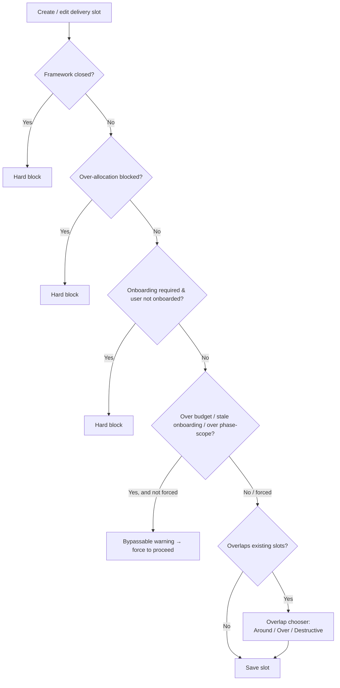

# Booking & Validation

When you create or edit a **delivery** slot, CHAOTICA runs a series of checks to prevent framework budget overruns, scheduling conflicts, and client‑onboarding gaps. This page covers those checks and the **overlap chooser** you get when a booking clashes with existing slots.

## How checks work

Each check returns one of:

- **Pass** — no issue, continue.
- **Hard block** — the slot can't be saved; you see an error you can only dismiss.
- **Bypassable warning** — you see a warning with a **Save** option; choosing it re‑submits with `force` set to skip bypassable checks.

The non‑overlap checks run first (framework → onboarding → phase scope). If they pass, overlaps are handled by the **chooser** described below.



## Non‑bypassable checks (hard blocks)

| Check | Trigger | Result |
|---|---|---|
| **Framework closed** | `framework.closed` | Can't schedule against a closed framework. |
| **Framework over‑allocated** | Booking pushes days above `total_days` **and** `allow_over_allocation` is off | Hard block with a budget breakdown (budget / allocated / this slot / would‑be total). |
| **Client onboarding required** | Client has `onboarding_required` and the user has **no** onboarding record for that client | The user must be onboarded first. |

## Bypassable warnings (force to proceed)

| Check | Trigger | Result |
|---|---|---|
| **Framework over‑budget** | Would exceed `total_days` but `allow_over_allocation` is on | Warning with budget breakdown; can force. |
| **Phase over‑scoped** | Booking this role's hours would exceed the phase's **scoped** hours for that delivery role | Warning; can force. |
| **Stale onboarding** | User is onboarded but the record is **stale** (past renewal) | Warning; can force. |

!!! note
    Multiple bypassable warnings can fire together (e.g. over‑budget *and* over‑scope); their messages are combined into one dialog.

## Overlap handling — the chooser

When a delivery booking (for a single person) overlaps existing slots in the range, CHAOTICA doesn't just block or double‑book — it asks how you want to proceed, showing a breakdown of what's in the way (leave/unavailable, other delivery, project, internal):

- **Book around** — skip the occupied days and book only the free working days, splitting the booking into multiple slots as needed. Weekends/holidays inside a run don't split it; a busy working day does.
- **Schedule over** — book one slot across the whole range on top of what's there (deliberate double‑booking).
- **Clear & book (destructive)** — delete the overlapping **delivery and project** work in the range, then book the whole range. **Leave, sick, bank holidays and other internal time are always kept** — the new booking sits on top of those.

!!! warning "Leave / time off is read‑only"
    Annual‑leave, sick and bank‑holiday slots can't be moved or edited from the scheduler — the block isn't draggable and the backend refuses the change. Manage them via the leave request. (Destructive booking never deletes them either.)

## Booking for multiple people (batch)

When you book across several people at once (Select‑mode multi‑row), each person is evaluated individually:

- People with **no issues** are booked.
- People with a **hard block** (e.g. not onboarded, framework closed) are **skipped** and reported in the summary.
- If any have **bypassable** warnings, you're asked once to **confirm/force**; on confirm, all eligible people are booked and the summary reports how many were booked and how many skipped.

## Budget calculations

Framework budget checks convert slot hours to days using the client's `hours_in_day`:

```
slot_days = round(slot_business_hours / client.hours_in_day, 1)
```

- New slot: `new_total = days_allocated + slot_days`
- Edited slot: `new_total = days_allocated - old_slot_days + new_slot_days`

See [Framework Agreements](../clients/framework_agreements.md) for the full budget model.

## Project & internal slots

- **Project** slots run overlap checks only (no framework/onboarding). An unavailable overlap is a hard block; a working overlap is a bypassable warning.
- **Internal** slots (training, leave, etc.) and **comments** run no logic checks.

## Related Topics

- [Scheduling Overview](overview.md) — the interface and how to book/edit
- [Scheduling Concepts](concepts.md) — scoped vs scheduled, delivery roles, confirmed/tentative
- [Framework Agreements](../clients/framework_agreements.md) — budget tracking and allocation controls
- [Managing Phases](../Jobs/phases/managing_phases.md) — phase scoping before scheduling
