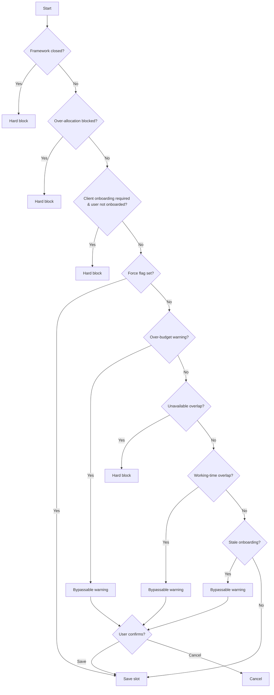

# Scheduling Validation

When creating or editing delivery slots, CHAOTICA runs a series of validation checks to prevent common scheduling issues. These checks protect against framework budget overruns, scheduling conflicts, and client onboarding gaps.

## How Checks Work

Each check evaluates the proposed time slot and returns one of three outcomes:

- **Pass** — No issue, proceed to the next check
- **Hard block** — The slot cannot be saved; the user sees an error message
- **Bypassable warning** — The user sees a warning dialog with "Save" and "Cancel" options; choosing "Save" re-submits the form with `force=1` to skip bypassable checks

Checks run in a defined order. If a hard block fires, later checks are skipped.

## Check Order



## Non-Bypassable Checks

These checks produce a hard block that cannot be overridden.

| Check | Trigger | What Happens |
|---|---|---|
| **Framework Closed** | `framework.closed == True` | The slot cannot be created. Message: the framework is closed and no further time can be scheduled against it. |
| **Framework Over-Allocated** | Slot would push `days_allocated` above `total_days` **and** `allow_over_allocation == False` | Hard block with budget breakdown showing: budget, already allocated, this slot's days, and the would-be total. |
| **Client Onboarding Required** | Client has `onboarding_required == True` and the user has no onboarding record for this client | Hard block — the user must be onboarded before being scheduled. |
| **Unavailable Overlap** | Slot overlaps with non-working time (leave, sick, etc.) | Hard block — cannot schedule delivery work over unavailable time. |

## Bypassable Checks

These checks produce a warning that the user can choose to override.

| Check | Trigger | What Happens |
|---|---|---|
| **Framework Over-Budget Warning** | Slot would push `days_allocated` above `total_days` **and** `allow_over_allocation == True` | Warning showing budget breakdown. User can confirm to proceed or cancel. |
| **Overlapping Working Slots** | Slot overlaps with other working-time slots (delivery, project) | Warning listing the overlapping slots. User can force-save. |
| **Stale Onboarding** | User has an onboarding record but `is_stale == True` (expired) | Warning that onboarding is out of date. User can force-save. |

!!!note
    Multiple bypassable warnings can fire at the same time. For example, a slot could trigger both an over-budget warning and an overlap warning — the feedback messages are concatenated.

## Budget Calculations

Framework budget checks convert time slot hours to days using the client's `hours_in_day` setting:

```
slot_days = round(slot_business_hours / client.hours_in_day, 1)
```

For new slots: `new_total = days_allocated + slot_days`

For edited slots: `new_total = days_allocated - old_slot_days + new_slot_days`

See [Framework Agreements](../clients/framework_agreements.md) for full details on budget tracking.

## Edit and Resize Checks

The same framework checks apply when **editing** or **resizing** delivery slots via drag-and-drop. The `_check_framework_slot()` helper handles both cases by comparing the old slot's days against the updated slot's days, ensuring budget recalculations are accurate on modification — not just creation.

## Project Slot Checks

Project slots run a simpler set of checks:

- **Unavailable overlap** — Hard block if the slot overlaps non-working time
- **Working-time overlap** — Bypassable warning if it overlaps other working slots

Project slots do **not** run framework or onboarding checks.

## Related Topics

- [Scheduling Overview](overview.md) — General scheduling interface and slot types
- [Framework Agreements](../clients/framework_agreements.md) — Budget tracking and allocation controls
- [Managing Phases](../Jobs/phases/managing_phases.md) — Phase setup and lifecycle
