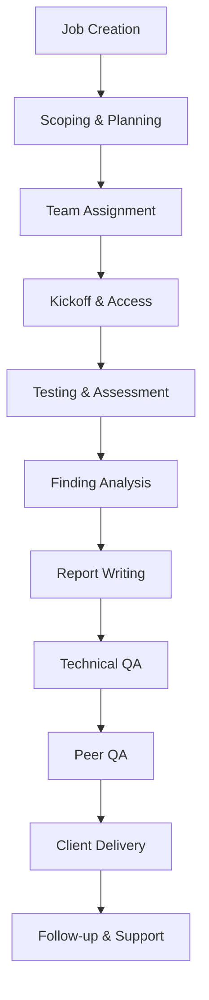

# Security Assessment Process

The security assessment process in CHAOTICA follows a structured methodology designed to deliver consistent, thorough, and professional security assessments. This guide outlines the complete process from initial scoping through final delivery.

## Assessment Methodology Overview

### Core Principles

**Systematic Approach**:
- Standardized methodologies for each service type
- Consistent testing procedures and techniques
- Repeatable processes for quality assurance
- Comprehensive documentation requirements

**Risk-Based Focus**:
- Business impact-driven assessment priorities
- Client environment and risk tolerance consideration
- Practical and actionable recommendations
- Clear communication of risk and remediation

**Professional Excellence**:
- Industry standard methodologies and frameworks
- Continuous improvement and best practice adoption
- Quality assurance and peer review processes
- Client-focused delivery and communication

### Assessment Lifecycle



## Phase 1: Scoping and Planning

### Initial Scoping

**Scope Definition**:
- Target systems and applications identification
- Assessment boundaries and limitations
- Testing windows and time constraints
- Access requirements and procedures
- Special considerations and restrictions

**Client Requirements Analysis**:
- Business objectives and priorities
- Compliance and regulatory requirements
- Risk tolerance and sensitivity levels
- Previous assessment history and context
- Specific client concerns or focus areas

**Scoping Activities**:
1. **Requirements Gathering**
   - Client questionnaire completion
   - Stakeholder interviews
   - Technical environment review
   - Constraint and limitation identification

2. **Scope Documentation**
   - Detailed scope statement creation
   - Assumptions and dependencies listing
   - Testing approach definition
   - Timeline and milestone planning

3. **Client Approval**
   - Scope review and client feedback
   - Modifications and adjustments
   - Final scope approval and sign-off
   - Statement of work finalization

### Resource Planning

**Team Composition**:
- Required skills and expertise identification
- Team size and role assignments
- Experience level requirements
- Specialty knowledge needs

**Timeline Development**:
- Assessment phase duration estimates
- Testing window coordination
- Report writing and review timeframes
- Client interaction and meeting schedules

**Tool and Resource Requirements**:
- Testing tools and software licenses
- Hardware and infrastructure needs
- Access credentials and permissions
- Documentation and template resources

## Phase 2: Team Assignment and Preparation

### Team Assembly

**Role Assignments**:
- **Project Lead**: Overall coordination and client relationship
- **Senior Consultant**: Technical leadership and complex testing
- **Consultants**: Core assessment and testing work
- **Report Author**: Documentation and report writing
- **TQA Reviewer**: Technical quality assurance
- **PQA Reviewer**: Professional quality assurance

**Skill Matching**:
- Technical expertise alignment
- Client industry experience
- Service-specific knowledge
- Language and communication skills

### Pre-Assessment Preparation

**Team Briefing**:
- Project background and objectives
- Client context and environment
- Scope boundaries and limitations
- Team roles and responsibilities
- Communication protocols and procedures

**Technical Preparation**:
- Tool setup and configuration
- Testing environment preparation
- Methodology review and customization
- Evidence collection procedures
- Documentation templates preparation

**Access Coordination**:
- VPN and network access setup
- Application credentials and permissions
- Physical site access arrangements
- Emergency contact procedures
- Communication channel establishment

## Phase 3: Assessment Execution

### Kickoff and Initial Activities

**Client Kickoff Meeting**:
- Project introduction and team presentation
- Scope confirmation and expectation setting
- Access procedure finalization
- Communication protocol establishment
- Timeline and milestone confirmation

**Initial Reconnaissance**:
- Target environment discovery
- System and service enumeration
- Architecture and topology mapping
- Initial vulnerability identification
- Attack surface analysis

### Testing Methodology

**Systematic Testing Approach**:
1. **Information Gathering**
   - Open source intelligence (OSINT)
   - Network and service discovery
   - Application fingerprinting
   - Technology stack identification

2. **Vulnerability Identification**
   - Automated scanning and analysis
   - Manual testing and validation
   - Configuration review
   - Code analysis (if applicable)

3. **Exploitation and Validation**
   - Proof-of-concept development
   - Impact demonstration
   - Privilege escalation testing
   - Lateral movement assessment

4. **Post-Exploitation Analysis**
   - Data access and extraction
   - Persistence mechanism testing
   - System compromise assessment
   - Business impact evaluation

### Evidence Collection

**Documentation Standards**:
- Screenshot capture and annotation
- Command output recording
- Network traffic analysis
- Log file collection and analysis
- Video recordings for complex demonstrations

**Evidence Management**:
- Secure storage and encryption
- Version control and organization
- Access control and permissions
- Retention and disposal procedures
- Chain of custody maintenance

### Daily Operations

**Progress Tracking**:
- Daily standup meetings (for larger teams)
- Progress updates to project lead
- Issue and blocker identification
- Timeline adjustment as needed
- Client communication coordination

**Quality Control**:
- Peer review of findings
- Evidence validation and verification
- False positive identification and removal
- Consistent documentation standards
- Regular checkpoint reviews

## Phase 4: Analysis and Documentation

### Finding Analysis

**Risk Assessment**:
- Likelihood and impact evaluation
- Business context consideration
- Exploitability assessment
- Remediation complexity analysis
- Regulatory compliance impact

**Risk Rating Matrix**:
```
Impact vs Likelihood Matrix:
                Low    Medium   High
High Impact     Medium  High    Critical
Medium Impact   Low     Medium  High
Low Impact      Info    Low     Medium
```

**Finding Categorization**:
- **Critical**: Immediate business risk, easy exploitation
- **High**: Significant risk, moderate exploitation difficulty
- **Medium**: Notable risk, requires specific conditions
- **Low**: Limited risk, difficult to exploit
- **Informational**: No direct risk, awareness item

### Report Writing Process

**Report Structure**:
1. **Executive Summary**
   - Business-focused overview
   - Key findings and recommendations
   - Risk summary and priorities
   - Strategic recommendations

2. **Technical Details**
   - Methodology and approach
   - Detailed finding descriptions
   - Evidence and proof-of-concept
   - Technical remediation guidance

3. **Recommendations**
   - Prioritized action items
   - Implementation guidance
   - Resource requirements
   - Timeline recommendations

**Writing Guidelines**:
- Clear and concise language
- Appropriate technical depth for audience
- Consistent terminology and formatting
- Professional presentation standards
- Client-specific customization

### Evidence Integration

**Supporting Materials**:
- Screenshot organization and annotation
- Code snippets and configurations
- Network diagrams and visualizations
- Tool outputs and scan results
- Video demonstrations (if applicable)

**Quality Assurance**:
- Evidence validation and verification
- Consistent formatting and presentation
- Proper attribution and sourcing
- Client confidentiality protection
- Secure handling procedures

## Phase 5: Quality Assurance

### Technical Quality Assurance (TQA)

**TQA Focus Areas**:
- Technical accuracy verification
- Methodology compliance confirmation
- Evidence sufficiency validation
- Risk rating appropriateness
- Recommendation practicality

**TQA Process**:
1. Complete technical review of all findings
2. Evidence validation and verification
3. Risk assessment confirmation
4. Methodology compliance check
5. Feedback provision and iteration

### Peer Quality Assurance (PQA)

**PQA Focus Areas**:
- Professional presentation quality
- Client readiness assessment
- Communication effectiveness
- Deliverable completeness
- Brand and standard compliance

**PQA Process**:
1. Professional quality review
2. Client-specific customization verification
3. Executive summary effectiveness check
4. Final presentation polish
5. Delivery preparation and approval

## Phase 6: Client Delivery

### Delivery Preparation

**Final Deliverable Package**:
- Main assessment report (PDF)
- Executive presentation slides
- Evidence package (if required)
- Remediation guidance documents
- Follow-up meeting materials

**Quality Verification**:
- Final format and presentation check
- Client branding and customization
- Confidentiality markings verification
- Distribution list confirmation
- Delivery method selection

### Client Presentation

**Delivery Meeting**:
- Executive summary presentation
- Key findings discussion
- Risk prioritization and impact
- Remediation planning guidance
- Questions and clarification session

**Presentation Best Practices**:
- Business-focused messaging
- Clear risk communication
- Actionable recommendations
- Interactive discussion facilitation
- Follow-up planning

### Post-Delivery Support

**Client Support Services**:
- Clarification and question answering
- Additional evidence provision
- Remediation guidance and support
- Progress tracking assistance
- Follow-up assessment planning

**Documentation and Closure**:
- Client feedback collection
- Lessons learned documentation
- Process improvement identification
- Project closure and archival
- Relationship maintenance

## Service-Specific Methodologies

### Web Application Assessment

**OWASP-Based Approach**:
- OWASP Top 10 comprehensive coverage
- Business logic flaw identification
- Authentication and authorization testing
- Session management evaluation
- Input validation and sanitization

**Testing Techniques**:
- Manual code review and testing
- Automated scanning integration
- Dynamic application security testing
- Static code analysis (if applicable)
- API security assessment

### Infrastructure Assessment

**Network Security Focus**:
- Network architecture review
- Firewall and segmentation testing
- Server and service hardening
- Access control evaluation
- Monitoring and logging assessment

**System Security Testing**:
- Operating system hardening
- Patch management evaluation
- Service configuration review
- Privilege escalation testing
- Data protection mechanisms

### Penetration Testing

**Adversarial Simulation**:
- Red team methodology adoption
- Attack chain development
- Stealth and evasion techniques
- Persistence mechanism testing
- Exfiltration simulation

**Kill Chain Approach**:
1. Reconnaissance and information gathering
2. Initial access and foothold establishment
3. Privilege escalation and lateral movement
4. Persistence and stealth maintenance
5. Data access and exfiltration
6. Impact demonstration and cleanup

## Continuous Improvement

### Process Enhancement

**Regular Reviews**:
- Methodology effectiveness evaluation
- Client feedback integration
- Industry best practice adoption
- Tool and technique updates
- Team skill development planning

**Metrics and KPIs**:
- Assessment quality scores
- Client satisfaction ratings
- Time-to-delivery metrics
- Finding accuracy rates
- Team productivity measures

### Knowledge Management

**Documentation and Templates**:
- Methodology guide maintenance
- Report template improvements
- Finding database development
- Best practice documentation
- Training material updates

**Team Development**:
- Regular training and certification
- Knowledge sharing sessions
- Peer mentoring programs
- Conference and industry participation
- Cross-service experience development

## Risk Management

### Assessment Risks

**Technical Risks**:
- System availability and stability
- Data integrity and confidentiality
- Network performance impact
- Unintended system disruption
- Evidence corruption or loss

**Business Risks**:
- Client relationship impact
- Legal and regulatory compliance
- Intellectual property protection
- Professional liability exposure
- Reputation and brand risk

### Risk Mitigation

**Preventive Measures**:
- Comprehensive testing procedures
- Backup and recovery planning
- Insurance and liability coverage
- Professional standard compliance
- Regular training and certification

**Contingency Planning**:
- Issue escalation procedures
- Emergency response protocols
- Client communication plans
- Technical recovery procedures
- Legal and compliance support

## Related Topics

- [Quality Assurance](quality_assurance.md) - Detailed QA processes and procedures
- [Managing Phases](../Jobs/phases/managing_phases.md) - Phase management and execution
- [Team Management](../team/user_management.md) - Team coordination and resource management
- [Reporting](../reporting/overview.md) - Report generation and delivery processes